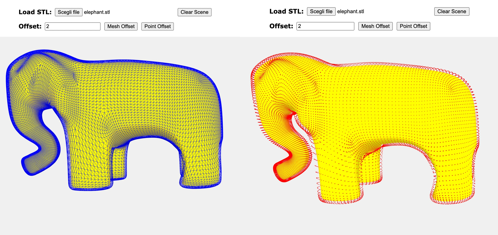

# Offset with three.js
Create an offset set of points or an offset mesh from an STL file using the [three.js](https://threejs.org/) library.

### Demo
https://threejs-offset.netlify.app/

## Table of Contents
- [Offset with three.js](#offset-with-threejs)
    - [Demo](#demo)
  - [Table of Contents](#table-of-contents)
  - [General info](#general-info)
  - [Setup](#setup)

## General info

This simple application gives you a basic idea of an offset on a mesh. You can try the functionality with different files and different offset values.   

With this application is possible to try adding an offset to your mesh and obtain a list of points or a meshed offset. We have two different algorithms, one to manipulate the point offset and another for the meshed offset.

The logic of the first algorithm is based on getting the vertices and the normals of the geometry of the selected mesh and creating an array of new vertices with the given offset and then creating a new 3D object, with points.

The logic of the second one is more complicated and the results are not perfect, but it's a starting point. Let's look at the steps to obtain the meshed offset.

A mesh has a geometry with a list of vertices and normals. We want to get the faces of the mesh, calculate a new position with the passed offset and the normal of the faces and then reposition the faces in the correct place.

1. Exports the mesh as a not binary file and creates an object with the number of the face, the normal of this face and the three vertices of the face
2. Creates a hash table with the vertex in common on more faces as the key and the value is a list of objects with the face, the normal and the position of the vertex in the face.
3. Calculates the sum of the normals of the faces with the same vertex in common
4. Normalizes the normal
5. Calculates the new position with the offset, the normal and the vertex
6. Adds the new position in the correct position of the new object (this is a clone of the initial object)
7. At the end calculates the new normals with the new positions and completes the new object
8. Creates a mesh from the new objects 
## Setup

If you want to start the application locally:

1. Clone the project `git clone git@github.com:AngyDev/threejs-offset.git`
2. With your terminal go to the folder where you cloned the project
3. Run the command `npm install` to install the project's dependencies
4. Run the command `npm run build` that creates the dist folder
5. Run the server with the command `npm run start` 
6. If all is correct the browser will be open to the `localhost:8080` url