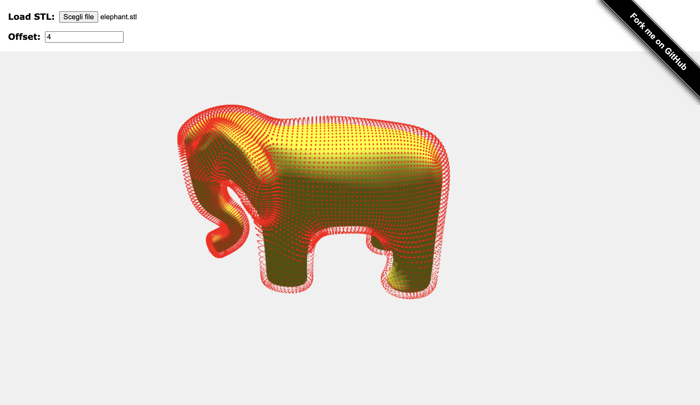

# Offset with three.js
Create an offset set of points from an STL file using the [three.js](https://threejs.org/) library

### Demo
https://threejs-offset.netlify.app/

## Table of Contents
- [Offset with three.js](#offset-with-threejs)
    - [Demo](#demo)
  - [Table of Contents](#table-of-contents)
  - [General info](#general-info)
  - [Setup](#setup)

## General info

This simple application gives you a basic idea of an offset on a mesh. You can try the functionality with different files and different offset values.   

The logic of the algorithm is based on getting the vertices and the normals of the geometry of the selected mesh and creating an array of new vertices with the given offset and then creating a new 3D object, with points or if you want, you can use a THREE.Mesh.
## Setup

If you want to start the application locally:

1. Clone the project `git clone git@github.com:AngyDev/threejs-offset.git`
2. With your terminal go to the folder where you cloned the project
3. Run the command `npm init` that creates the package.json file
4. Run the command `npm i live-server` that installs the server on your project
5. Run the server with the command `live-server`
